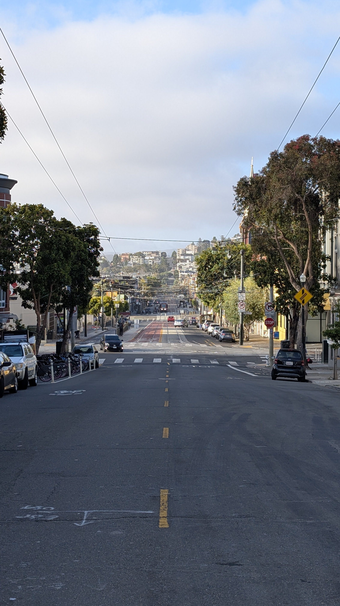
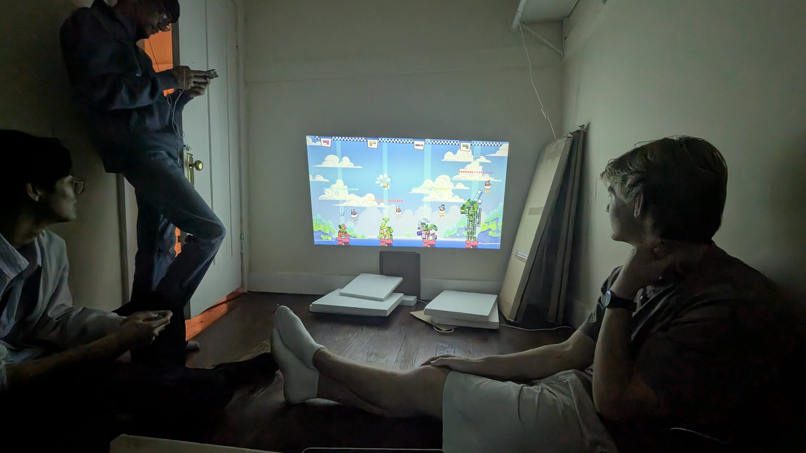
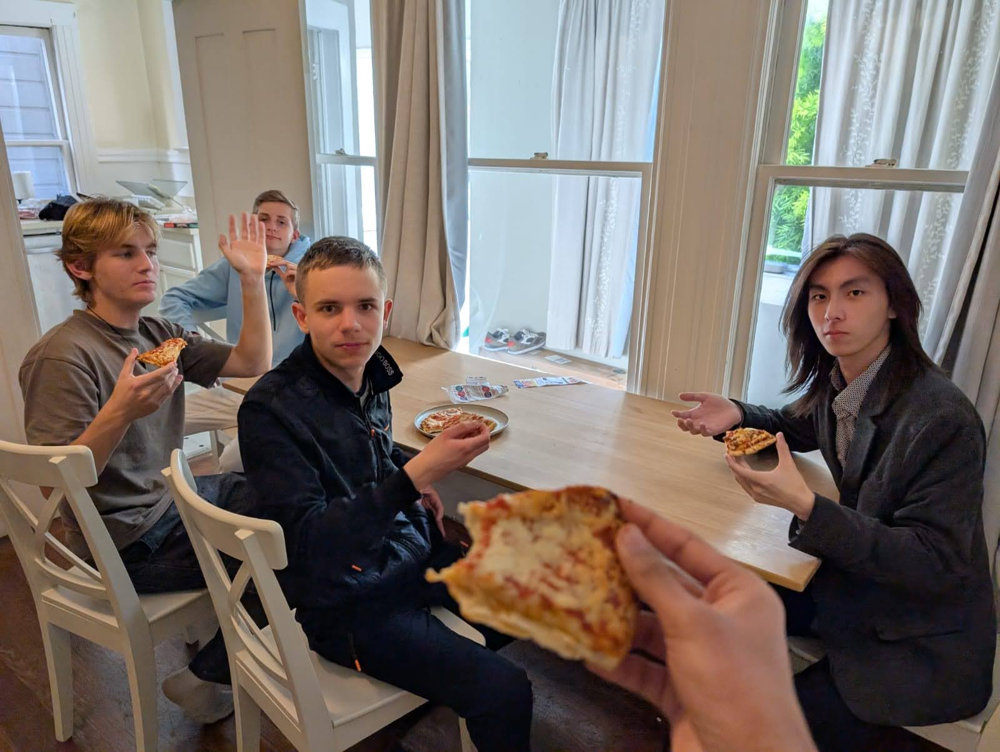
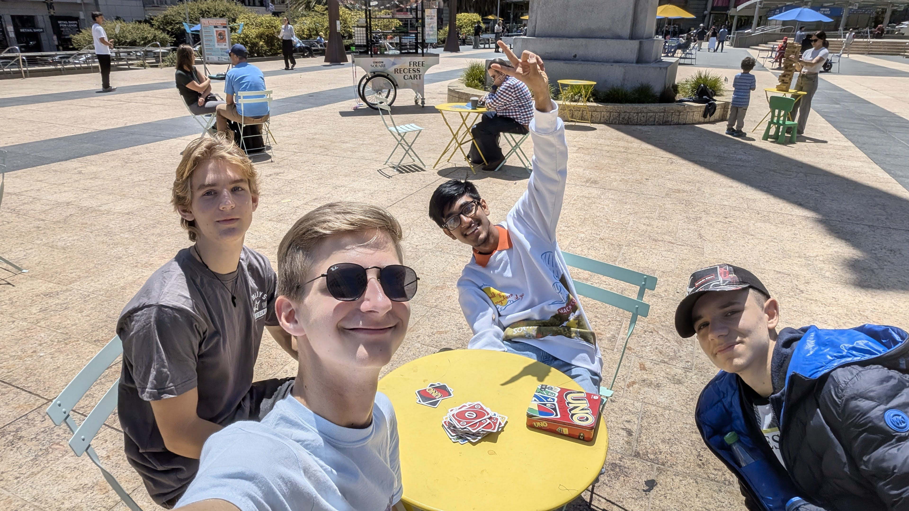
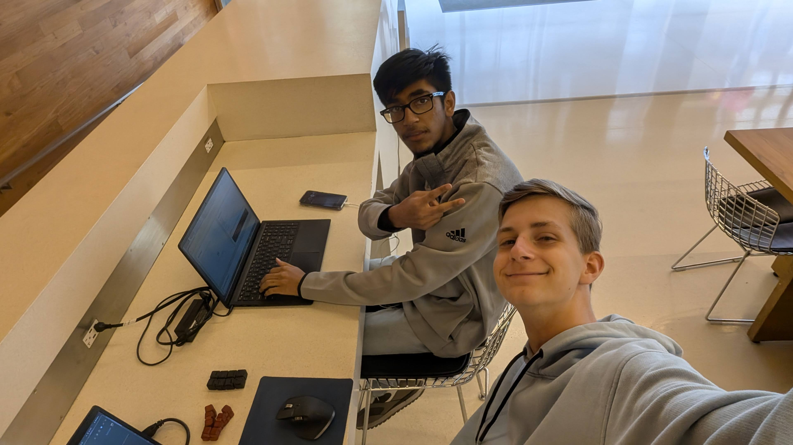

### Day -8, The Days Leading Up to SF 6/10
{hole}
## Almost There!

I’m typing this while racing to hit 100 hours of work on my website project-only 20 minutes to go! Once I cross that finish line, I’ll have exactly 16 days until my big trip to San Francisco.

## What Happened Today
When the trains went on strike today, everyone switched to online classes. Normally we’d get the day off, but apparently we’ve been too “rested” lately. So here I am-Zooming away, coffee in hand, multitasking like a champ while jotting down these notes.

### Day 1
{left}
## Before the flight
I arrived at Schiphol with my brother, mom, and dad. After a few hugs and a very real “this is it” moment at the gate, I waved goodbye and stepped into solo travel mode. Next stop: San Francisco. Alone. For real.

## My Flight,
The flight itself? Surprisingly chill. I somehow scored three seats to myself. I stretched out (kinda), watched Interstellar for the 2nd time, and vibed to music until sleep finally kicked in. Sure, it wasn’t five-star comfort, but it did the job.

## I arived!
Touchdown in San Francisco! But of course, my story couldn’t be that smooth, border control wasn’t quite sure what to make of my “I’m going to build stuff with internet nerds I met online” explanation. So they took me into a separate room for an “interview.”

After explaining Hack Club, convincing them I’m not a threat to national security, and answering a few curious questions, they gave me the green light.

I took the BART (Bay Area metro) into the city, and then walked nearly 3 miles uphill with my backpack and suitcase. Welcome to San Francisco: the city of tech dreams.

## Pizza party
When I finally got to the house, Paolo and my roommates were already heading out, to a pizza-making party at the other Hack Club house. Even though I felt like a zombie, I tagged along. We made pizzas until 11pm, and by then my body had given up on being alive.

## Attempting Sleep
Everyone else had their bed setups ready with pillows and cozy blankets. Me? I had a couch pillow from the other house and a thin airplane blanket. It was freezing in the house. I barely slept. So yeah—end of Day 0, and I’m basically running on nothing.

### Day 2
{right}
## Morning After the Storm
After that awful night of tossing and turning, I gave up trying to sleep by 6am. My body thought it was 3pm anyway. I got up, hit the toilet, and had a chill early-morning chat with one of my roommates. I ate an apple, walked to a local café, and called my mom.

I told her the truth:
“This isn’t really what I expected... I’m not sure I want to stay the full time.”
Big feelings, right from the start.

## Chat With Paolo
Later, Paolo (a organizer and housemate) sat down with me to chat about what I wanted to build here while im at San fransico.
Truth be told, I had no clue. I thought it’d be like Juice in Shanghai, but this time, there was too much freedom. No structure. No guide rails. Just… “do your thing.”
It hit me: I’ve never really lived independently, let alone worked in a self-directed way from 9 to 5. It was overwhelming, and I started questioning whether I’d made the right choice.

## 12PM & Some Normalcy
After sulking in bed for way too long, Paolo and Abby suggested we head to the Hack Club open space—a big, cozy area where everyone was coding, vibing, and doing their thing.
We grabbed lunch on the way, and honestly, I finally started to feel a little bit like myself again.

But the peace didn’t last long—
Paolo dipped early with a headache, and Abby went out for food… and just *never came back.* So now I was alone, surrounded by laptops and strangers, wondering what to do next.

Cue: spontaneous side quest.

## The Random Adventure
{right vertical}
Feeling restless, I called my brother just to check in, and my dad jumped on the call too. With my family on the line and no destination in mind, I just started walking—somewhere. Anywhere.

That “anywhere” turned out to be… **LinkedIn HQ.**
Yup. Just stumbled right into the corporate heart of networking itself.

There was a big public lounge space inside—suits and startup folks having Very Important Conversations™. And me? I walked up to the front desk like,
“Hey, got any stickers?”
A few minutes later, I walked out with some LinkedIn swag: stickers and a branded keychain lanyard. Mission accomplished.

## The Great Pillow Rescue
After wrapping up the call, I realized I had unfinished business: **Sleep.**
Last night’s setup, rock-hard couch pillow and a too-small airplane blanket—wasn’t going to cut it again.

So I went on a heroic quest to Target, hunting for something softer, warmer, and just… not awful.
It wasn’t exactly a luxury hotel haul, but it was a major upgrade. Mission: *mostly* successful.

## Grocery Chaos
{left horizantal}
Later in the day, the five of us decided to stock up on breakfast and other essentials. Easy, right?
Turns out, not so much. With five people from different cultures, everyone had totally different ideas of what to buy. After aimlessly wandering for ten minutes, we finally made a list and split up.

My task? Apples and bananas. And—no joke—we were standing right next to the fruit section.
Mission complete in under 10 seconds.

By the time we got home it was nearly 7pm, and I was starving. But I was so exhausted I just went to bed instead. Food could wait—sleep couldn’t

## Midnight Dinner
I woke up around 11pm, still tired but now super hungry. I made a PB&J sandwich—nothing fancy, just bread, peanut butter, and jelly.
That was dinner. Simple, but it did the trick.

Right as I finished, new roommates showed up. We're now 7 people in the house. It’s getting cozy!

### Day 3 – Feeling Better
{hole}

## Morning Reset
Woke up at 6am again—jet lag still doing its thing. I didn’t want to wake anyone, so I grabbed some fruit and went for a quiet walk.

I called home and said something important:
**"I'm feeling way better today."**

Yesterday was rough, but I realized I can’t wait for things to be fun—I have to make them fun.
Paolo mentioned that attending events could count as programming time if we show proof—2 hours per event. That sounded perfect. I was in.

## Target Trip, Part II
{right horizantal}
Realized I still didn’t have a towel. So, back to Target! This time with four of us, picking up towels, dish soap, plates—everything we forgot the first time.

After a much-needed shower, I wrote down yesterday’s and today’s notes. Then we went to the Hack Club workspace downtown, where I worked on my own operating system—**NickOS**—and finally got it running on my laptop.

## Thomas’s Curry Night
On my way back home, I got a DM:

> "Thomas is cooking dinner for everyone at 7pm at Lower Haight."

By the time I arrived, Thomas, Paolo, and Nick A, were cooking curry for **20 people**.
Smoke alarms went off (a lot), but people kept showing up, 4, then 8, then 14… eventually over 20 crammed into the house!
It was chaos, but so much fun. And the curry? Surprisingly great.

# Game Night
{hole}
Later, Paolo pulled out his Nintendo Switch, and we played Mario Kart and some wild tower-stacking game. Laughter, yelling, and close finishes everywhere.

# Cards from Home
{hole}
I brought out a special deck of playing cards from my grandparents.
We played some chill games on the floor with music in the background. A small moment, but it felt really nice.
Here’s a polished, more readable version of your **Day 4 – 6/19** entry, keeping it casual and fun for your family:

### Day 4 – 6/19
{right}
## Golden Gate Bridge Adventure
For most of the day, not much really happened. But around 6pm, things picked up, we all headed out to visit the Golden Gate Bridge.

Our group of 8 was the first to arrive, so we walked partway across the bridge while waiting for the others. Eventually, about 14 of us were there.

At one point, I realized I was unintentionally leading the group—just walking ahead with no idea where I was going. So, naturally, I picked a random path… and somehow ended up at a pier.

We joked that it felt like we were in a *Lemmings* game, everyone just blindly following along!

Along the way, I talked with a few people and ended up having a blast hanging out with **Elliott** and **Om**—super chill and hilarious guys. Definitely a highlight of the day.

# frozen pizza
{right}
All of us did not feel like cooking and wanded something simple before going to the bridge. So, WE GOT **PIZZAS**! 6 of them actualy. but only some of the group wanted pizzas and so we had like half a pizza left and did not use 2 other pizzas. 
So we have more leftovers for another day!

### Day 5. ٩(ˊᗜˋ )و
## I dind't do anything interesting today

### Day 6 – 6/21
{right}

## City Adventure!
The day started with my usual morning walk, and then we decided to head to Market Street to find a good spot to work on our 40 programming hours.

We tried multiple locations, but since it was Saturday, most places were closed—except **Salesforce Park**. It's this elevated park surrounded by Salesforce buildings, with a cable car leading up and even a small band playing country music. We hung out there for a bit and enjoyed the vibe before continuing our search.

## .
{left nobottommargin disapearat500px}

## Apple Vision Pro Experience
{right bigasmain}

On our walk, we stumbled across a couple of cool stores—one of the only Nintendo locations in the area, and of course, an Apple Store.

Inside, we saw the **Apple Vision Pro** on display and noticed they had open booking slots… in just one hour. So we killed some time in Chinatown, grabbed ice cream, and played a game of UNO in the sun. Then it was time to try Apple’s $3,500 goggles.

## My Honest Review:

1) I honestly can’t think of anyone who’d *really* benefit from owning one in day-to-day life.
2) Gaming? Not great. The only thing I managed to play was **3D solitaire**.
3) I tried opening Excel and it felt clunky—not ideal for real work.
4) **BUT** the eye tracking? Super slick. Your eyes act like a mouse, and you can “pinch” your fingers anywhere to click. It felt smart and surprisingly smooth.

Will I go back to play with it again? Absolutely. You can book as many sessions as you want, and I definitely will.

## Midnight Programming
{left vertical}

Since most of us were *nowhere near* the 40-hour mark, we all ended up staying up way past midnight trying to catch up. Around 2am, I finally called it quits.

I spent most of that time working on my multiplayer escape room game—where you solve puzzles with friends online—and chatting with others until I realized how late it was.

Final count for me this week? **18 hours** of “programming.” Out of the goal of 40.
Do I feel like I’m getting kicked out?
Not really…
But I guess we’ll find out soon. **(• - •)ゝ**

### Day 7 – 6/22
{right}

## Sunday Vibes & Burritos
We woke up around 9am and went on our usual mini morning walk (ᵔ◡ᵔ)
Not long after, we got a message from Thomas:

> **"Meet at 12pm in Dolores Park to kick off the new week and eat burritos!"**

Sounded like a perfect plan.
Before heading out, I had a super encouraging call with my mom and brother about my new game idea—a 2D online escape room with physics. It really got me hyped to build something fun!

When we arrived at Dolores Park, all the Hack Club houses had gathered—about **36 people** in total! We lounged in the sun, chatted, and devoured some *chicken burritos*
Eventually, about half of us decided to head to the open workspace downtown to get some hours in.

## Battery Crisis
{left}
Once we got there… we realized something.
**None of the Europeans brought their power adapters.**
So while we all set up our laptops, they started dying. One by one. Slowly. Tragically.
Before long, all our batteries were dead and we had to head home to grab our adapters.

When we finally returned, the workspace was already closing—it shuts at 6pm. So we had to pivot.
## Hotel Coding Session
We wandered around and ended up finding a random hotel with a comfy lobby where we could sit and code (´｡• ᵕ •｡\`)
Honestly? It was kind of perfect.

There, I clocked **8.4 hours** of focused programming—working more on my online escape room game. Felt good to finally make solid progress toward my weekly goal.

While coding, I even got a surprise video call from none other than **Paperclip**! (╯✧▽✧)╯
We chatted for a bit… about nothing particularly important, but it was still a fun little moment to wrap up a weird, wandering, productive day.
### Day 8 – Time Flies
{left}
## Wait… it’s already Day 8?!

Today it hit me—**I’ve already been here for 8 days**. Time is flying way too fast!
We decided to start planning a few things since it’s the **last week for Om** (*nooo*). So we made two awesome plans:

1. Apply for an event about **ComfyUI** at **GitHub HQ**
2. Plan a visit to **Paperclip**, who’s nearby this week!

I’m super excited for both! (≧◡≦)/

## Back to LinkedIn HQ
{right}
In the morning, Om and I headed straight to **LinkedIn HQ** to get in some serious programming time. A bit later, **Elliott** joined us too.
We ended up staying there for **5 full hours** of coding! That brings my total to...

**12 HOURS!!** ヽ(・∀・)ﾉ

I’m currently **#2 on the leaderboard**, with the top person already at 23 hours
Still, I’ve got a solid lead on #3, so I’m feeling good about where I’m at!

## Grilled Cheese Break & More Coding
After our LinkedIn coding session, we went back home for a quick grilled cheese recharge
Then—back out again to the open workspace to put in even more hours. Gotta keep the momentum going!